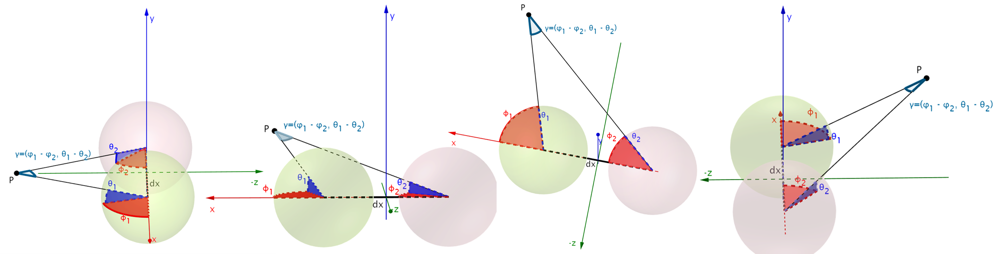
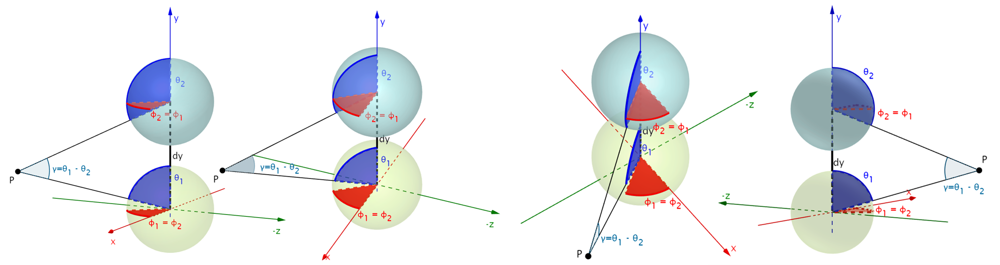

# Abstract

Learning based approaches for depth perception are limited by the availability of clean training data. 
This has led to the utilization of view synthesis as an indirect objective for learning depth estimation using efficient data acquisition procedures. 
Nonetheless, most research focuses on pinhole based monocular vision, with scarce works presenting results for omnidirectional input.
In this work, we explore spherical view synthesis for learning monocular 360<sup>o</sup> depth in a self-supervised manner and demonstrate its feasibility.
Under a purely geometrically derived formulation we present results for horizontal and vertical baselines, as well as for the trinocular case.
Further, we show how to better exploit the expressiveness of traditional CNNs when applied to the equirectangular domain in an efficient manner.
Finally, given the availability of ground truth depth data, our work is uniquely positioned to compare view synthesis against direct supervision in a consistent and fair manner.
The results indicate that alternative research directions might be better suited to enable higher quality depth perception.
Our data, models and code are publicly available at [our project page](https://vcl3d.github.io/SphericalViewSynthesis/).

___

# Spherical Disparity
We derive our spherical disparity model under a purely geometrical formulation.
Spherical stereo comprises two spherical viewpoints that image their surroundings in their local spherical coordinate system.
These are related via their 3D displacement (_i.e._ `baseline`), defined in a global Cartesian coordinate system.

<p align="center">
  
</p>

By taking the analytical partial derivatives of the Cartesian to spherical conversion equations, a formulation of spherical angular disparity in terms of the radius (_i.e._ `depth`) and the `baseline` is made.

<p align="center">
  
</p>

Considering a horizontal (red, &#x1F534;) stereo setup (_i.e._ displacement only along the `x` axis) as well as a vertical (blue, &#x1F535;) stereo setup (_i.e._ displacement only along the `y` axis) it is apparent that the former includes both longitudinal as well as latitudinal angular displacements, while the latter one only includes latitudinal, as also illustrated in the following figures.





As a result, we can use this depth derived disparity formulation to self-supervise spherical depth estimation. Crucially, for the horizontal case, this is only possible using depth-image-based rendering (DIBR) instead of inverse warping, as it helps in overcoming the irregular remappings of stereo spherical imaging. We rely on a recently presented differentiable DIBR (__\[[3](#LSI)\]__), and additionally employ spherical weighting as an attention mechanism to address inconsistent gradient flows at the singularities. Finally, we also experiment with trinocular stereo placements and with infusing spherical spatial knowledge into the network implicity through the use of Coordinate Convolutions (__\[[4](#CoordConv)\]__).

## Code
[](https://github.com/VCL3D/SphericalViewSynthesis)

Our training and testing code that can be used to reproduce our experiments can be found at the corresponding [GitHub repository](https://github.com/VCL3D/SphericalViewSynthesis).

Different training scripts are available for each variant:
* [`train_ud.py`](https://github.com/VCL3D/SphericalViewSynthesis/blob/d5229a26ec8f5843fa053ef995721ae4f7e61128/train_ud.py) for vertical stereo (__UD__) training
* [`train_lr.py`](https://github.com/VCL3D/SphericalViewSynthesis/blob/d5229a26ec8f5843fa053ef995721ae4f7e61128/train_lr.py) for horizontal stereo (__LR__) training
* [`train_tc.py`](https://github.com/VCL3D/SphericalViewSynthesis/blob/d5229a26ec8f5843fa053ef995721ae4f7e61128/train_tc.py) for trinocular stereo (__TC__) training, using the `photo_ratio` argument to train the different __TC__ variants.
* [`train_sv.py`](https://github.com/VCL3D/SphericalViewSynthesis/blob/d5229a26ec8f5843fa053ef995721ae4f7e61128/train_sv.py) for supervised (__SV__) training

The PyTorch implementation of the differentiable depth-image-based forward rendering ([_`splatting`_](https://github.com/VCL3D/SphericalViewSynthesis/blob/d5229a26ec8f5843fa053ef995721ae4f7e61128/supervision/splatting.py#L9)), presented in __\[[3](#LSI)\]__ and originally implemented in [TensorFlow](https://github.com/google/layered-scene-inference), is also [available](https://github.com/VCL3D/SphericalViewSynthesis/blob/9d8fcee90d2601c396c27d8261fb3c786e3e46a7/supervision/splatting.py#L73).

Our evaluation script [`test.py`](https://github.com/VCL3D/SphericalViewSynthesis/blob/d5229a26ec8f5843fa053ef995721ae4f7e61128/test.py) also includes the adaptation of the metrics calculation to spherical data that includes [spherical weighting](https://github.com/VCL3D/SphericalViewSynthesis/blob/d5229a26ec8f5843fa053ef995721ae4f7e61128/spherical/weights.py#L8) and [spiral sampling](https://github.com/VCL3D/SphericalViewSynthesis/blob/d5229a26ec8f5843fa053ef995721ae4f7e61128/test.py#L92).

## Pre-trained Models
Our PyTorch pre-trained models (corresponding to those reported in the paper) are available at our [releases](https://github.com/VCL3D/SphericalViewSynthesis/releases) and contain these model variants:

* [__UD__ @ epoch 16](https://github.com/VCL3D/SphericalViewSynthesis/releases/download/UD/ud.pt)
* [__TC8__ @ epoch 16](https://github.com/VCL3D/SphericalViewSynthesis/releases/download/TC8/tc8.pt)
* [__TC6__ @ epoch 28](https://github.com/VCL3D/SphericalViewSynthesis/releases/download/TC6/tc6.pt)
* [__TC4__ @ epoch 17](https://github.com/VCL3D/SphericalViewSynthesis/releases/download/TC4/tc4.pt)
* [__TC2__ @ epoch 20](https://github.com/VCL3D/SphericalViewSynthesis/releases/download/TC2/tc2.pt)
* [__LR__ @ epoch 18](https://github.com/VCL3D/SphericalViewSynthesis/releases/download/LR/lr.pt)
* [__SV__ @ epoch 24](https://github.com/VCL3D/SphericalViewSynthesis/releases/download/SV/sv.pt)

___

# Data
The 360<sup>o</sup> stereo data used to train the self-supervised models are available [here](https://vcl3d.github.io/3D60/) and are part of a larger dataset __\[[1](#OmniDepth), [2](#HyperSphere)\]__ that contains rendered color images, depth and normal maps for each viewpoint in a trinocular setup.

___

# Publication
## Paper
<a href="./assets/documents/svs.pdf"></a>

## Supplementary
<a href="./assets/documents/supp.pdf"></a>

## Authors
[Nikolaos Zioulis](zokin.github.io), [Antonis Karakottas](https://ankarako.github.io/), [Dimitris Zarpalas](https://www.iti.gr/iti/people/Dimitrios_Zarpalas.html), [Federico Alvarez](https://www.researchgate.net/profile/Federico_Alvarez3) and [Petros Daras](https://www.iti.gr/iti/people/Petros_Daras.html)

[Visual Computing Lab (VCL)](http://vcl.iti.gr/)

## Citation
If you use this code and/or data, please cite the following:
```
@inproceedings{zioulis2019spherical,
  author       = "Zioulis, Nikolaos and Karakottas, Antonis and Zarpalas, Dimitris and Alvarez, Federic and Daras, Petros",
  title        = "Spherical View Synthesis for Self-Supervised $360^o$ Depth Estimation",
  booktitle    = "International Conference on 3D Vision (3DV)",
  month        = "September",
  year         = "2019"
}
```

# Acknowledgements
We thank the anonymous reviewers for helpful comments.

This project has received funding from the European Union’s Horizon 2020 research and innovation programme [__Hyper360__](http://hyper360.eu/) under grant agreement No 761934.

We would like to thank NVIDIA for supporting our research with the donation of a NVIDIA Titan Xp GPU through the NVIDIA GPU Grant Program.


# Contact
Please direct any questions related to the code, models and dataset to [nzioulis@iti.gr](mailto:nzioulis@iti.gr) or post a [GitHub issue](https://github.com/VCL3D/SphericalViewSynthesis/issues).

# References
<a name="OmniDepth"/>__\[[1](https://vcl.iti.gr/360-dataset)\]__ Zioulis, N.__\*__, Karakottas, A.__\*__, Zarpalas, D., and Daras, P. (2018). [Omnidepth: Dense depth estimation for indoors spherical panoramas](https://arxiv.org/pdf/1807.09620.pdf). In Proceedings of the European Conference on Computer Vision (ECCV).

<a name="HyperSphere"/>__\[[2](https://vcl3d.github.io/HyperSphereSurfaceRegression/)\]__ Karakottas, A., Zioulis, N., Samaras, S., Ataloglou, D., Gkitsas, V., Zarpalas, D., and Daras, P. (2019). [360<sup>o</sup> Surface Regression with a Hyper-sphere Loss](https://arxiv.org/). In Proceedings of the International Conference on 3D Vision (3DV).

<a name="LSI"/>__[3]__ Tulsiani, S., Tucker, R., and Snavely, N. (2018). [Layer-structured 3d scene inference via view synthesis](https://arxiv.org/pdf/1807.10264.pdf). In Proceedings of the European Conference on Computer Vision (ECCV).

<a name="CoordConv"/>__[4]__ Liu, R., Lehman, J., Molino, P., Such, F. P., Frank, E., Sergeev, A., and Yosinski, J. (2018). [An intriguing failing of convolutional neural networks and the coordconv solution](https://arxiv.org/pdf/1807.03247.pdf). In Advances in Neural Information Processing Systems (NIPS).
